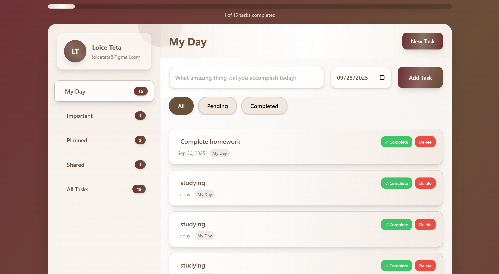

# Task Management Board

A simple and elegant web-based task management dashboard to help you organize, track, and complete your daily tasks efficiently.

## Features

- **Add, complete, and delete tasks**
- **Categorize tasks** (My Day, Important, Planned, Shared, All)
- **Filter tasks** by status (All, Pending, Completed)
- **Progress bar** to visualize your productivity
- **Responsive design** for desktop and mobile

## Getting Started

### Prerequisites

- A modern web browser (Chrome, Firefox, Edge, Safari)

### Installation

1. **Clone this repository:**
   ```sh
   git clone https://github.com/Loicet/Task-Management-Board.git
   ```
2. **Navigate to the project folder:**
   ```sh
   cd Task-Management-Board
   ```
3. **Open `index.html` in your browser.**

No build tools or server required!

## Usage

- Click **New Task** to add a new task.
- Use the sidebar to switch between categories.
- Use the filter buttons to view all, pending, or completed tasks.
- Mark tasks as complete or delete them as needed.

## Folder Structure


Task-Management-Board/
├── index.html
├── script.js
├── README.md


## Customization

- You can edit the categories or styles by modifying `index.html` and `script.js`.
- The app uses [Tailwind CSS](https://tailwindcss.com/) via CDN for styling.

Project's screenshot 

**AUTHOR**
Loice Teta

<!-- Project End -->